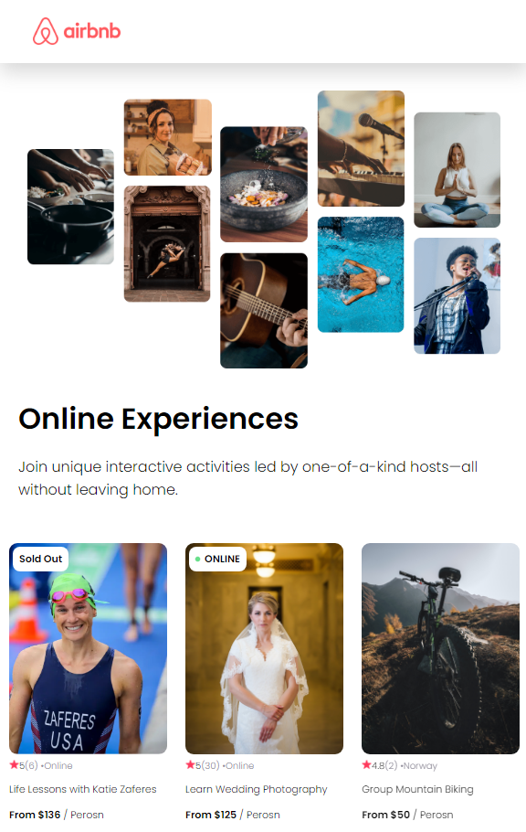

# React Airbnb Expriences Clone

## Screen Capture 1



## screen Capture 2 (live)


> [!IMPORTANT]
> Must need to install git & node before begain:
> 1. [git](https://git-scm.com/downloads)
> 2. [node](https://nodejs.org/en)

to download the project:
````
$ git clone https://github.com/akashs-arkar1489/Airbnb-Clone.git
$ cd AIRBNB-CLONE
````

to start locally
````
$ cd AIRBNB-CLONE
$ npm run dev
````

to start in your personal network:
````
$ cd AIRBNB-CLONE
$ npm run dev -- --host
````

thanks😘